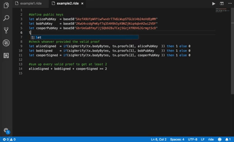
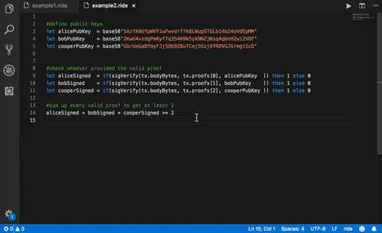
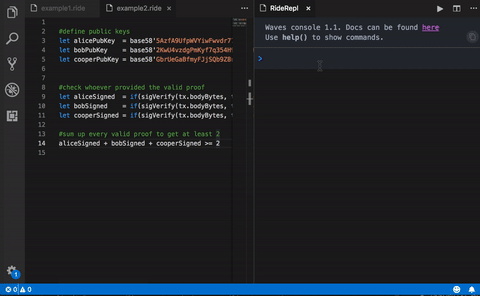
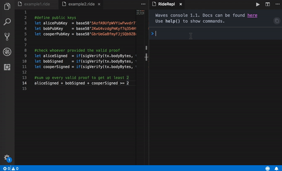
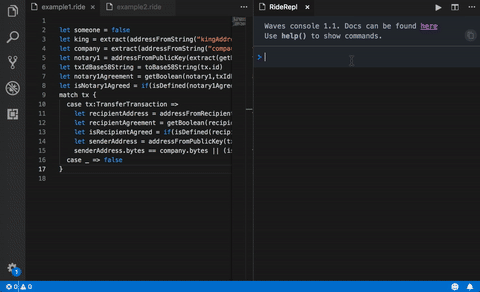

#Visual Studio Code Extension

Waves Ride language extension and REPL for Visual Studio Code provides:
* Syntax highlighting
* Code completion for global functions and fields
* Snippets
* Interactive console console for Waves blockchain

##Installation
You can find waves-ride extension in Visual Studio Code Marketplace or by the link below:

 Waves-RIDE Extension 

## Usage
Extension recognizes `*.ride` files by default.

### Code completion
Use standard Ctrl/Command + Space to autocomplete. Global functions, variables, transaction types are supported. Pattern matching and if/else statements supported via snippets.

### Error highlighting
Currently shows first compilation error. Invalid base64 and base58 strings are highlighted via syntax highlighting.

### Interactive console
To open interactive console run "Start Waves Repl" task via command palette (Shift + CTRL/Command + P). Waves Repl is a javascript console with convenient functions to interact with blockchain. Console provides helpers for these functions.

### Available functions

**Transactions:**
> You can create and sign transactions. All functions take transaction parameters and optional seed to sign. If no seed is provided, default one from settings will be used. For more detailed list check [@waves/waves-transactions](https://www.npmjs.com/package/@waves/waves-transactions) library, that is used internally

* `alias(txParams, seed?)` - create and sign createAlias transaction
* `issue(txParams, seed?)` - create and sign issue transaction
* `reissue(txParams, seed?)` - create and sign reissue transaction
* `lease(txParams, seed?)` - create and sign lease transaction
* `cancelLease(txParams, seed?)` - create and sign cancelLease transaction
* `burn(txParams, seed?)` - create and sign burn transaction
* `transfer(txParams, seed?)` - create and sign transfer transaction
* `massTransfer(txParams, seed?)` - create and sign massTransfer transaction
* `setScript(txParams, seed?)` - create and sign setScript transaction
* `data(txParams, seed?)` - create and sign data transaction

**Addresses and keys:**
> You can generate keyPairs from seed. If no seed is provided, default one from settings will be used.

* `keyPair(seed?)` - create key pair. Both private and public
* `privateKey(seed?)` - create private key
* `publicKey(seed?)` - create public key
* `address(seed?)` - create address from seed

**Code interaction:**
> You can interact with code in the editor with helper function below.

* `contract()` - retrieves text from current active editor with .ride file
* `file(fileName)` - retrieves text from open editor with .ride file by file name
* `compile(text)` - compiles contract code

**Blockchain interaction:**
> You can broadcast transaction to blockchain or publish current script

* `broadcast(tx, apiBase?)` - send transaction to waves node
* `deploy()` - shortcut to broadcast(setScript({script:compile(contract())}))

##Settings
In the default [VS Code settings](https://code.visualstudio.com/docs/getstarted/settings) you can change extension defaults.

**Default chain id**

`rideExtention.repl.CHAIN_ID:` "T"

**Default seed**

`rideExtention.repl.SEED:` "our default example seed for ride extension plugin inside visual studio code"

**Node URL**

`rideExtention.repl.API_BASE:` "https://testnodes.wavesnodes.com"
